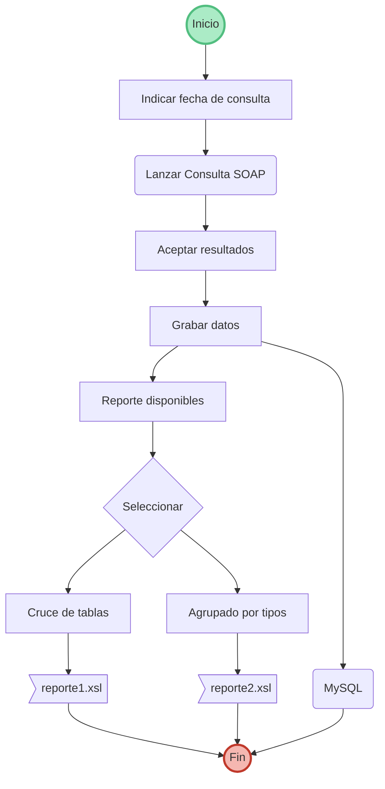

# Bienvenido al consumo de SOAP para B2BTIC

Este aplicativo ha sido desarrollado empleando PHP 7.2 y MySQL 5.7

# Instalación

Se debe copiar el contenido del repositorio en el directorio raiz de Apache2.
Se debe ejecutar las instrucciones del archivo bd.sql.

## MVC con Twig

Para las vistas en el modelo MVC  de este programa se empleó el motor de plantillas Twig.

## SoapClient

Se empleó el modulo nativo de soap que se puede integrar como módulo de PHP 7.2

## XSLT

En la carpeta XSL figuran los archivos que generarán los reporte requeridos.

## Diagrama de la solución

A continuación se presenta un diagrama de flujo que describe la solución planteada.

